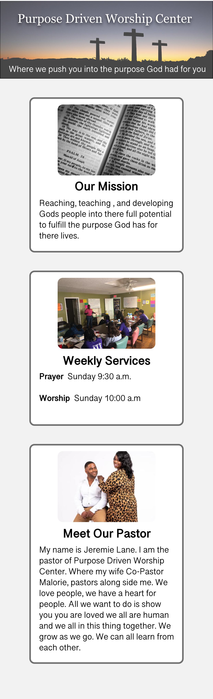

<!-- @format -->

# Purpose Driven Worship Center

This is a project for _Purpose Driven Worship Center_

## Updates

Here, I will put some upates as I edit the code and work on creating the
project.

---

### Adobe XD Design File

I went in a created a rough layout to start with using Adobe XD. First time
using the software. It is very handy to create a layout!

### Building the Design

So now, I am currently working on building the design. So I started out by
creating the _index.html_ file and creating the html code for the projec. As I
am building the html, I am doing the CSS of the project in sections. Mainly so I
can keep my CSS in order with the direction of the page.

---

#### Quick Update

So I have a rough draft of the mobile design. I have added a _location.html_
That way I can put a link to a map with the site.

### Redesign

I had to redesign the website. The original design wasn't very pleasing. So this
is what I switched it to. Kept the original idead, but made it more modern
feeling.

---

## Mobile Design

## Desktop Version

   

  

